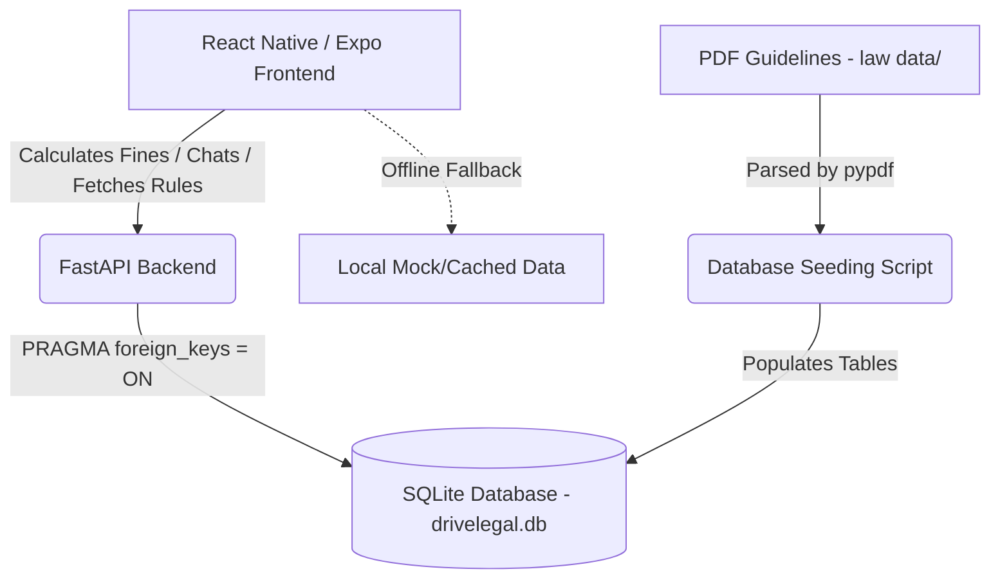

# DriveLegal 🚗⚖️

An AI-powered traffic law awareness and challan assistance mobile application, designed with a **mobile-first, offline-first** architecture for the Indian ecosystem. The application is now fully integrated with a structured SQLite database and a FastAPI backend.

---

## Repository Structure 📂

This repository contains the following directories:

*   **`frontend/`**: The React Native mobile application built with Expo and TypeScript.
*   **`backend/`**: The FastAPI REST API web server that manages the database queries, fine calculations, and chatbot lookups.
*   **`law data/`**: Legal guide PDFs used by the backend to seed rules and safety regulations.

---

## Integrated Architecture 🏗️



---

## Database Schema (11 Structured Tables) 🗄️

The database is built on top of SQLite under `backend/drivelegal.db` and is restructured into the following 11 tables:

1.  **`countries`**: Master country codes (IN, US, UK) and names.
2.  **`states`**: Region/state mapping referencing `countries`.
3.  **`cities`**: Coordinate-mapped municipal areas referencing `states`.
4.  **`traffic_rules`**: Detailed rules (Speed Limits, SOS Rules, etc.) referencing `states` and `cities`.
5.  **`vehicle_types`**: Vehicle categorizations (`2w`, `auto`, `car`, `commercial`, `heavy`).
6.  **`violations`**: Core traffic violations and categories.
7.  **`violation_penalties`**: Fines (1st, 2nd, and repeat offences), imprisonment terms, license points, and vehicle seizure rules by location, vehicle type, and violation.
8.  **`challan_calculations`**: Calculation log logs referencing vehicle types and violations.
9.  **`faq_knowledge`**: Question-answer knowledge bases for AI chatbot retrieval.
10. **`sync_versions`**: Data sync integrity and checksum verification records.
11. **`legal_sources`**: Official government acts and publication references.

---

## Tech Stack 🛠️

### Frontend
- **Framework**: React Native with Expo (TypeScript)
- **State Management**: Zustand with persistent storage (`AsyncStorage`)
- **Navigation**: Expo Router (File-based routing)
- **API Clients**: Built-in `fetch` client connecting to backend endpoints with automatic offline fallbacks.

### Backend
- **Framework**: FastAPI (Python)
- **Database**: SQLite3
- **PDF Extraction**: `pypdf` for reading text from `law data` guides.
- **Server**: Uvicorn ASGI web server.

---

## Real-Time Features & Enhancements 📡

The application is equipped with advanced real-time integration features:

1. **Auto-Seeding Startup Handler**: The FastAPI backend automatically initializes and seeds the SQLite database tables on startup if the database file is missing or contains incomplete tables.
2. **Dynamic Chatbot Location Parsing**: The chatbot is database-driven. It intercepts state and city names mentioned inside user queries (e.g. *"What is the helmet fine in Kerala?"*) and dynamically queries the database to override the active state and city context.
3. **Word-Boundary Resolution**: Chatbot keyword overrides use regex word boundary checks (like `\blos angeles\b`) to prevent substring collisions (e.g. prevents matching `"la"` inside `"kerala"`).
4. **Punctuation-Robust Matching**: Chatbot input undergoes punctuation cleaning before SQL `LIKE` and keyword matching, ensuring that punctuation characters (like `?`) do not break matching patterns.
5. **Dynamic FAQ Translation**: FAQ fallback answers dynamically replace references to template state/city names ("Maharashtra"/"Mumbai") with the active user location name on the fly.
6. **Native GPS Location Auto-Detection**: The container is configured with proper Android (`ACCESS_FINE_LOCATION`, `ACCESS_COARSE_LOCATION`) and iOS (`NSLocationWhenInUseUsageDescription`) permissions. Clicking "Auto-Detect Location (GPS)" prompts the device, queries coordinates via `expo-location`, reverse-geocodes, and updates the local context.
7. **Bundler-Safe Configurations**: Frontend config parses global environment variables safely using helper functions wrapped in `try-catch` scopes, preventing Metro compiler reference crashes.

---

## Quick Start 🚀

### 1. Backend Setup

1.  Navigate to the `backend` directory:
    ```bash
    cd backend
    ```
2.  Ensure you have python installed, and install the backend packages:
    ```bash
    pip install -r requirements.txt
    ```
3.  Seed the database (this will parse the PDF guides in the `law data` directory and populate the 11 SQLite tables):
    ```bash
    python seed_data.py
    ```
4.  Launch the API server:
    ```bash
    python app.py
    ```
    The server will run on `http://localhost:8000`.

### 2. Frontend Setup

1.  Navigate to the `frontend` directory:
    ```bash
    cd ../frontend
    ```
2.  Install dependencies:
    ```bash
    npm install
    ```
3.  Make sure `EXPO_PUBLIC_USE_MOCKS` is set to `false` (default) in your environment, which forces the app to request data from `http://localhost:8000`.
4.  Start the Expo development server:
    ```bash
    npm run web
    ```
    or press `a` for Android Emulator or `i` for iOS Simulator.

---

## Verification & Testing 🧪

You can run the backend automated test suite to verify database integrity, API routes, and profile management:

```bash
cd backend
python -m unittest test_backend.py
```

All 8 tests should compile and verify successfully.
